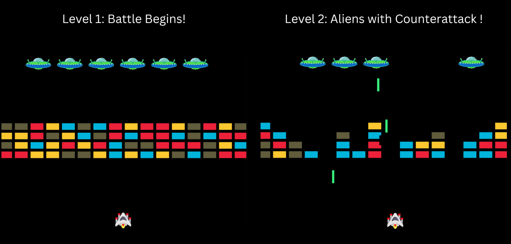

# 👾 Space Invaders (Python Turtle Edition)

## 🎮 Introduction

This is a **Space Invaders**-style arcade game built using **Python Turtle Graphics**.
The goal is simple: defend your spaceship, destroy alien ships, and survive as long as possible!
The game gets harder with each level as aliens begin to **counterattack**.

---

## 🖼️ Game Preview

<p align="center">
  
</p>

---

## ✨ Features

* Classic **arcade-style space shooting**.
* Multiple levels with increasing difficulty.
* Alien counterattacks for added challenge.
* Simple graphics built entirely with **Python Turtle**.
* Smooth and fun gameplay.

---

## 🎮 How to Play

* Use **← and → arrow keys** to move your spaceship.
* Press **Spacebar** to shoot bullets.
* Destroy all alien ships before they reach you.
* Survive counterattacks in higher levels.

---

## ⚙️ Installation & Run

1. Clone this repository:

   ```bash
   git clone https://github.com/your-username/space-invaders.git
   ```
2. Navigate into the project folder:

   ```bash
   cd space-invaders
   ```
3. Install dependencies:

   ```bash
   pip install -r requirements.txt
   ```
4. Run the game:

   ```bash
   python main.py
   ```

---

## 🤝 Developer

* **Maroof Gadiwale** – IT Student | Aspiring Data Scientist | ML Engineer ❤️

---

## 📜 License

This project is licensed under the **MIT License** – you are free to use, modify, and distribute with attribution.

---

